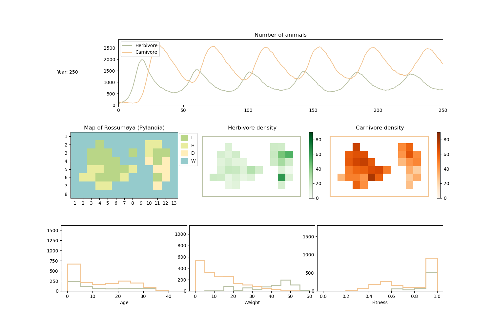

Examples
=================

Below are some examples of how to use the simulation framework.

Example simulation (without GUI):
---------------------------------

.. image:: _static/images/example_simulation.png
   :width: 700px
   :align: center
   :class: bordered-image

.. literalinclude:: ../examples/example_simulation.py
    :language: python

Example simulation (with GUI):
------------------------------

To use the GUI, import :mod:`biosim.gui` and run the following command: :code:`BioSimGUI()`. The
GUI will then be opened in its own window, and the rest is done throug it.

Some pros and cons of the GUI:

* Easy to visualise.

* Prevents the user from inputting invalid values.

* Easy to use.

* Possibility of modifying all animal and landscape parameters.

* Able to continue on the previous simulation. In between simulations, the user may modify the
  parameters or add animals. There are also options to restart the simulation or to slaughter all
  animals.

* Not able to specify visualisation parameters, as these are updated dynamically.

* Able to navigate back and forth from drawing and simulating etc.

* Super fun!

OUTDATED VIDEO.

.. raw:: html

   <iframe width="700" height="394" src="https://www.youtube.com/embed/1mKAqzywuL8" title="YouTube video player" frameborder="0" allow="accelerometer; autoplay; clipboard-write; encrypted-media; gyroscope; picture-in-picture; web-share" allowfullscreen></iframe>

Try it out for yourself!:

.. literalinclude:: ../examples/example_gui.py
    :language: python

Example changing species' parameters:
-------------------------------------

Changing the species' parameters yield a different result. Here is an example changing a few of
the parameters.

.. literalinclude:: ../examples/example_different_parameters.py
    :language: python

Making a mp4 movie:
-------------------

Saves a movie in the specified directory (can be absolute or nonexisting). The movie is saved as
the specified filename, and is created using the saved images of the simulation.

.. literalinclude:: ../examples/example_save_movie.py
    :language: python
