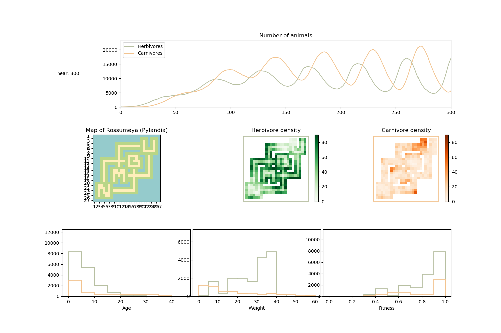

Examples
=================

Below are some examples of how to use the simulation framework.

Example simulation (without GUI):
---------------------------------

.. literalinclude:: ../examples/example_simulation.py
    :language: python

Example simulation (with GUI):
------------------------------

To use the GUI, import :mod:`src.biosim.gui` and create an instance of the GUI class, specifying the
desired map size (:code:`instance = BioSimGUI(map_size)`). The GUI will then open in a new window
when :code:`instance.mainloop()` is called.

Some pros and cons of the GUI:

* Easy to visualise.

* Prevents the user from inputting invalid values.

* A bit clumsy when navigating from the simulation plot back to the GUI.

* Easy to use.

* Able to continue on the previous simulation (as well as add animals), or reset it.

* Unable to specify parameters for the simulation.

* Able to navigate back and forth from drawing and simulating.

* Super fun!

.. image:: _static/images/example_gui.gif
   :width: 700px
   :align: center
   :class: bordered-image

To use the GUI, run the following code (and change :code:`map_size` to your liking):

.. literalinclude:: ../examples/example_with_gui.py
    :language: python

Making a mp4 movie:
-------------------

Saves a movie in the specified directory (can be absolute or nonexisting). The movie is saved as
the specified filename.

.. literalinclude:: ../examples/example_save_movie.py
    :language: python