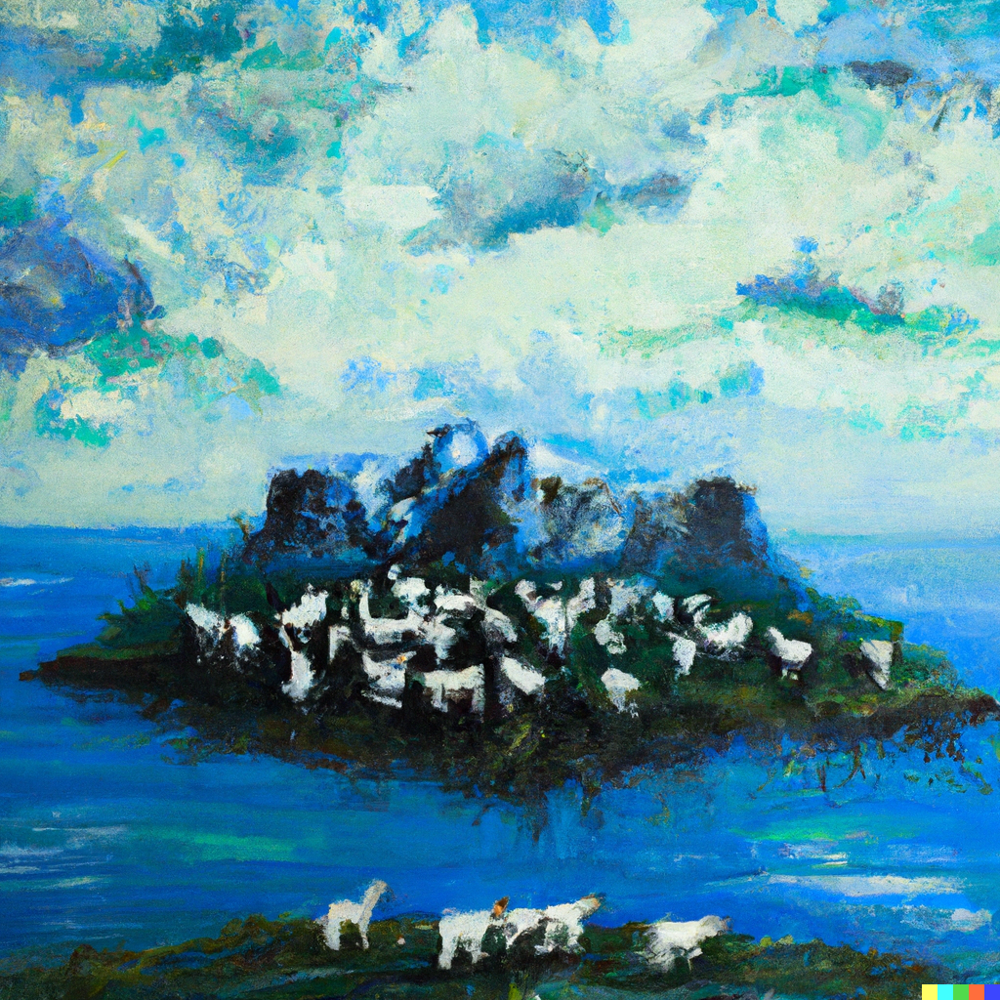

.. BioSim documentation master file, created by
   sphinx-quickstart on Wed Jun 14 08:06:57 2023.
   You can adapt this file completely to your liking, but it should at least
   contain the root `toctree` directive.

Welcome to BioSim's documentation!
==================================

.. raw:: html

   

      The BioSim package is a framework for modelling biological systems. It is developed as part of
      the course INF200 at the Norwegian University of Life Sciences. The package contains tools for a
      simple biological simulation, and is designed to be easily extendable. The package is highly
      customisable, and easy to use.
   

.. raw:: html

   

      (Painting created by DALL·E-prompt of an abstract depiction of the BioSim package.)
   

.. toctree::
   :maxdepth: 3
   :hidden:

   animals
   island
   simulation

Indices and tables
==================

* :ref:`genindex`
* :ref:`modindex`
* :ref:`search`
